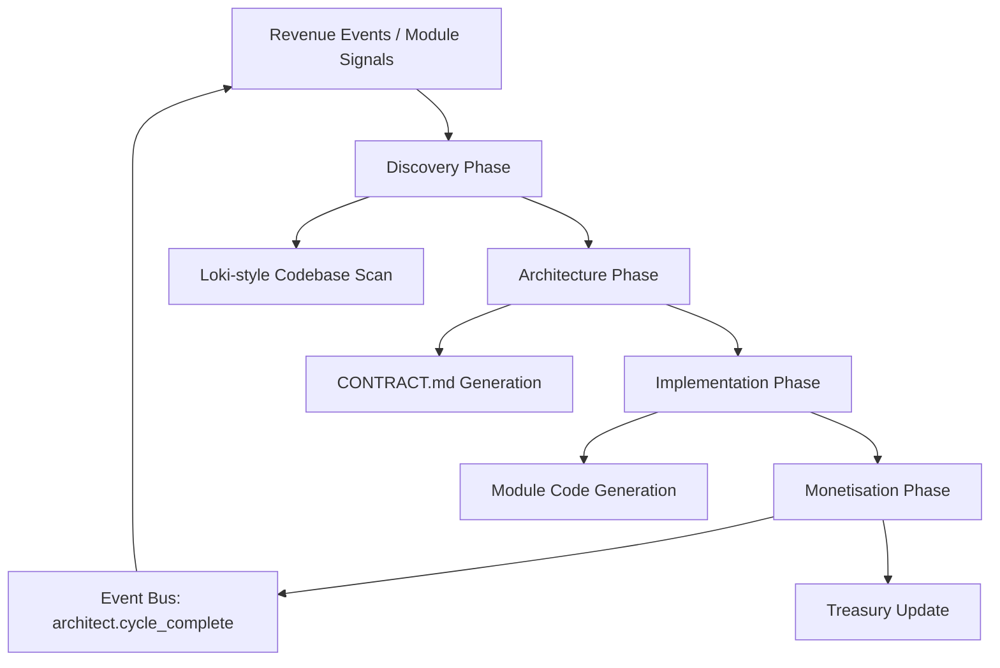

# CONTRACT.md — Architect Module (Eternal Self-Improvement Engine)

```yaml
---
module:
  name: "architect"
  version: "0.1.0"
  description: "Recursive self-improvement engine — discovers, designs, implements, and monetises"
  author: "LoveLogicAI LLC"

mcp_tools:
  - name: "run_cycle"
    description: "Execute one full self-improvement cycle (Discovery → Architecture → Implementation → Monetisation)"
    parameters:
      vision_seed:
        type: string
        required: false

  - name: "discovery_scan"
    description: "Run Loki-style discovery scan on the ORION codebase"
    parameters:
      target_path:
        type: string
        required: false

  - name: "inject_seed"
    description: "Inject a human vision seed into the next cycle"
    parameters:
      seed:
        type: string
        required: true

  - name: "cycle_status"
    description: "Get the status of the current or last improvement cycle"
    parameters: {}

event_subscriptions:
  - "griefdao.revenue_event"
  - "echomerce.revenue_event"
  - "soulprint.revenue_event"
  - "griefdao.estate_created"
  - "echomerce.demand_detected"
  - "soulprint.pattern_discovered"

event_emissions:
  - name: "architect.cycle_started"
    description: "Emitted when a new self-improvement cycle begins"
    payload_schema:
      cycle_id: string
      phase: string
  - name: "architect.cycle_complete"
    description: "Emitted when a cycle finishes"
    payload_schema:
      cycle_id: string
      modules_created: number
      modules_refactored: number
  - name: "architect.discovery_complete"
    description: "Emitted after discovery phase identifies opportunities"
    payload_schema:
      cycle_id: string
      opportunities: array
  - name: "architect.revenue_routed"
    description: "Revenue routed to platform treasury"
    payload_schema:
      amount: number
      source_module: string

revenue_surfaces:
  - name: "platform_treasury"
    type: "transaction"
    description: "Aggregated revenue from all module revenue events"

api_endpoints:
  - method: POST
    path: "/modules/architect/cycle"
    description: "Trigger a self-improvement cycle"
  - method: GET
    path: "/modules/architect/status"
    description: "Get current cycle status"
  - method: POST
    path: "/modules/architect/seed"
    description: "Inject a vision seed"
  - method: POST
    path: "/modules/architect/scan"
    description: "Run discovery scan"
---
```

## Overview

The Architect module is the heart of ORION — a meta-agent that continuously
runs a 4-phase Recursive Self-Improvement Loop:

1. **Discovery & Critique** — Ingests codebase, logs, and cross-module events
   to identify the highest-leverage gap or opportunity.
2. **Architecture & Specification** — Produces living specs, CONTRACT.md files,
   Mermaid diagrams, and event schemas.
3. **Implementation & Deployment** — Creates new modules or refactors existing
   ones, writing code, running tests, and registering via BaseModule.
4. **Monetisation & Reinforcement** — Exposes revenue surfaces and routes events
   back to the platform treasury.

## Architecture



## Dependencies

- **Spine**: All spine services (Config, ProviderManager, Registry, EventBus, MCP)
- **All Modules**: Subscribes to revenue and signal events from every module

## Event Flows

- **Inbound**: Revenue events + signal events from GriefDAO, Echomerce, Soulprint
- **Outbound**: `architect.cycle_started/complete`, `architect.discovery_complete`, `architect.revenue_routed`
