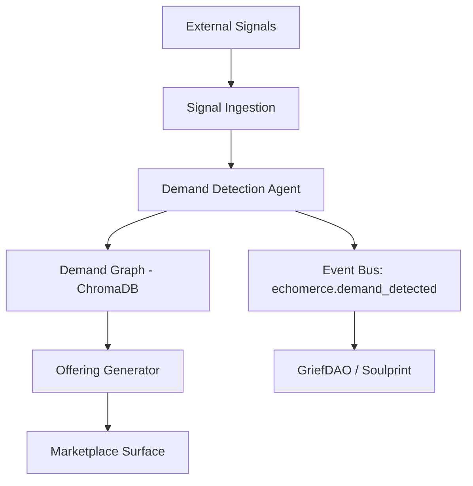

# CONTRACT.md — Echomerce Module

```yaml
---
module:
  name: "echomerce"
  version: "0.1.0"
  description: "Pre-demand commerce — predictive AI-driven market creation"
  author: "LoveLogicAI LLC"

mcp_tools:
  - name: "detect_demand"
    description: "Analyse signals to detect pre-demand opportunities"
    parameters:
      signal_data:
        type: object
        required: true
      market_context:
        type: string
        required: false

  - name: "create_offering"
    description: "Create a new product/service offering based on detected demand"
    parameters:
      demand_id:
        type: string
        required: true
      offering_spec:
        type: object
        required: true

  - name: "query_demand_graph"
    description: "Query the demand graph for patterns and opportunities"
    parameters:
      query:
        type: string
        required: true

event_subscriptions:
  - "soulprint.decision_analyzed"
  - "griefdao.estate_created"
  - "architect.cycle_complete"

event_emissions:
  - name: "echomerce.demand_detected"
    description: "Emitted when a pre-demand opportunity is identified"
    payload_schema:
      demand_id: string
      category: string
      confidence: number
  - name: "echomerce.offering_created"
    description: "Emitted when a new offering is created"
    payload_schema:
      offering_id: string
      demand_id: string
  - name: "echomerce.revenue_event"
    description: "Revenue generated from commerce transactions"
    payload_schema:
      amount: number
      currency: string
      surface: string

revenue_surfaces:
  - name: "demand_prediction_api"
    type: "api_call"
    description: "Per-call billing for demand prediction queries"
  - name: "marketplace_transaction"
    type: "transaction"
    description: "Commission on marketplace transactions"
  - name: "offering_subscription"
    type: "subscription"
    description: "Subscription for continuous demand monitoring"

api_endpoints:
  - method: POST
    path: "/modules/echomerce/detect"
    description: "Run demand detection on provided signals"
  - method: POST
    path: "/modules/echomerce/offerings"
    description: "Create a new market offering"
  - method: GET
    path: "/modules/echomerce/demand-graph"
    description: "Query the demand opportunity graph"
---
```

## Overview

Echomerce creates markets before demand exists by analysing behavioural signals,
cultural trends, and cross-module events to predict what people will need before
they know they need it. It operates a living demand graph that continuously
updates based on platform-wide intelligence.

## Architecture



## Dependencies

- **Spine**: EventBus, ProviderManager, Registry
- **ChromaDB**: Demand graph storage and similarity search

## Event Flows

- **Inbound**: `soulprint.decision_analyzed` and `griefdao.estate_created` feed the demand graph
- **Outbound**: `echomerce.demand_detected`, `echomerce.offering_created`, `echomerce.revenue_event`
