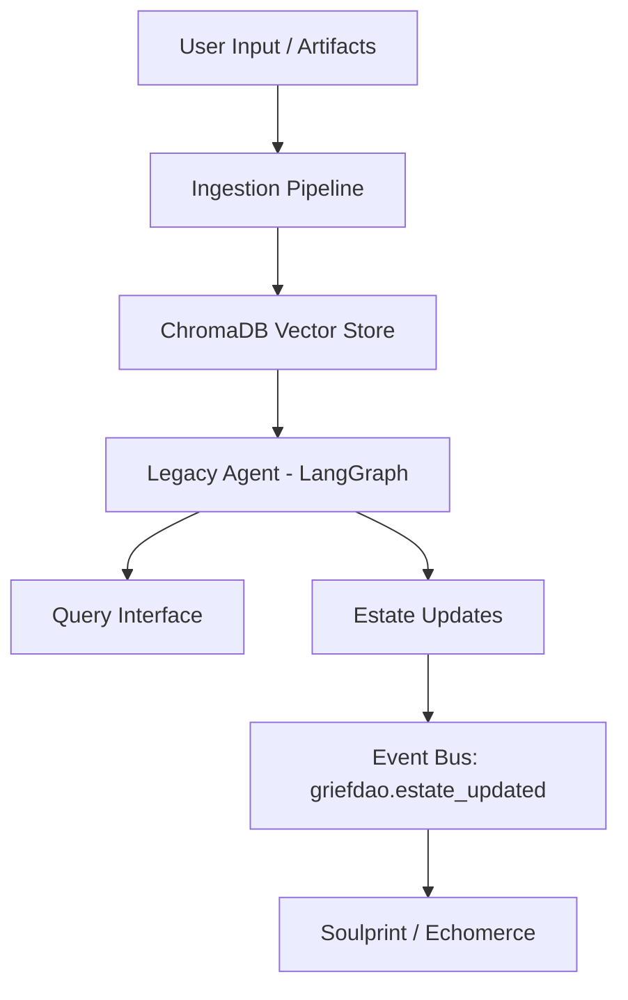

# CONTRACT.md — GriefDAO Module

```yaml
---
module:
  name: "griefdao"
  version: "0.1.0"
  description: "Perpetual digital legacies — AI-preserved memory estates"
  author: "LoveLogicAI LLC"

mcp_tools:
  - name: "create_legacy"
    description: "Create a new digital legacy estate for a person"
    parameters:
      person_name:
        type: string
        required: true
      initial_memories:
        type: array
        required: false

  - name: "query_legacy"
    description: "Query a legacy estate using natural language"
    parameters:
      estate_id:
        type: string
        required: true
      query:
        type: string
        required: true

  - name: "update_estate"
    description: "Add memories or artifacts to an existing estate"
    parameters:
      estate_id:
        type: string
        required: true
      artifacts:
        type: array
        required: true

event_subscriptions:
  - "soulprint.decision_analyzed"
  - "echomerce.demand_detected"
  - "architect.cycle_complete"

event_emissions:
  - name: "griefdao.estate_created"
    description: "Emitted when a new legacy estate is created"
    payload_schema:
      estate_id: string
      person_name: string
  - name: "griefdao.estate_updated"
    description: "Emitted when an estate is updated with new data"
    payload_schema:
      estate_id: string
      artifact_count: number
  - name: "griefdao.revenue_event"
    description: "Revenue generated from legacy services"
    payload_schema:
      amount: number
      currency: string
      surface: string

revenue_surfaces:
  - name: "legacy_subscription"
    type: "subscription"
    description: "Monthly subscription for perpetual estate maintenance"
  - name: "legacy_query_api"
    type: "api_call"
    description: "Per-query billing for estate interactions"

api_endpoints:
  - method: POST
    path: "/modules/griefdao/estates"
    description: "Create a new legacy estate"
  - method: GET
    path: "/modules/griefdao/estates/{estate_id}"
    description: "Retrieve estate details and summary"
  - method: POST
    path: "/modules/griefdao/estates/{estate_id}/query"
    description: "Natural language query against estate memories"
---
```

## Overview

GriefDAO creates and maintains perpetual digital legacies — AI-preserved memory
estates that allow people to interact with the preserved essence of loved ones.
Each estate is a living vector database of memories, writings, recordings, and
behavioural patterns that grows richer over time.

## Architecture



## Dependencies

- **Spine**: EventBus, ProviderManager (for LLM calls), Registry
- **ChromaDB**: Local vector store for memory embeddings

## Event Flows

- **Inbound**: `soulprint.decision_analyzed` triggers estate enrichment
- **Outbound**: `griefdao.estate_created`, `griefdao.estate_updated`, `griefdao.revenue_event`
