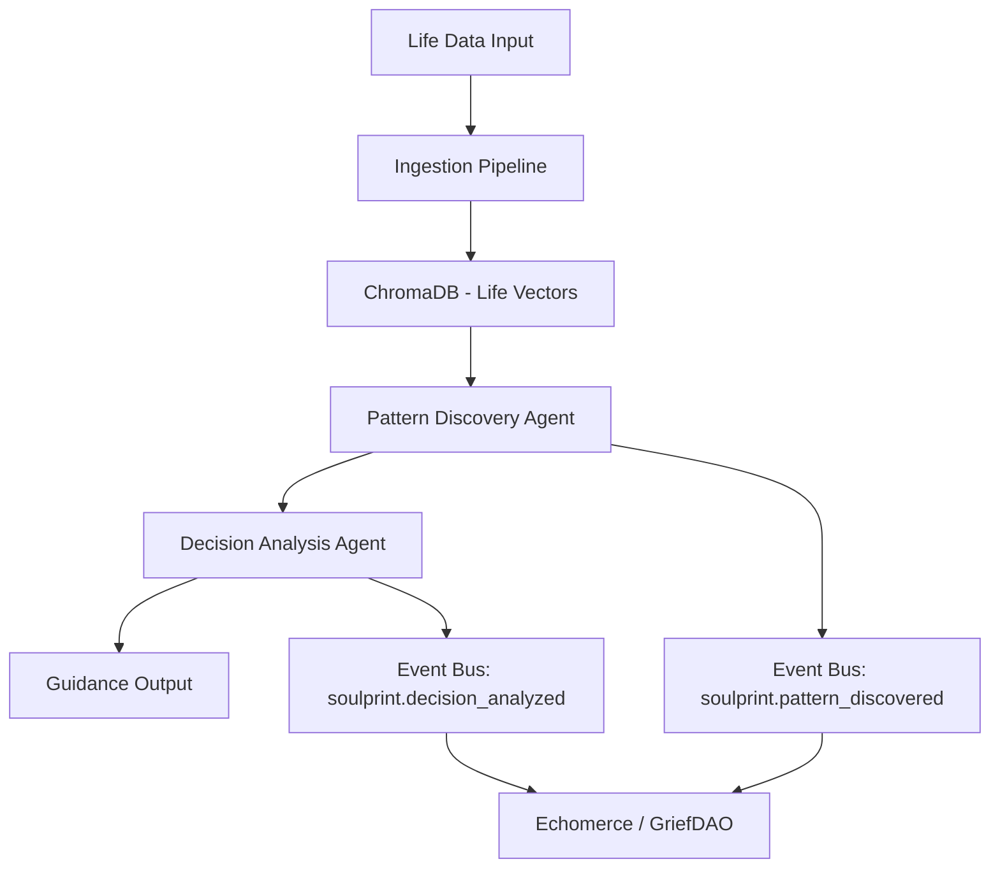

# CONTRACT.md — Soulprint Module

```yaml
---
module:
  name: "soulprint"
  version: "0.1.0"
  description: "Longitudinal life intelligence — pattern analysis and guidance"
  author: "LoveLogicAI LLC"

mcp_tools:
  - name: "analyze_decision"
    description: "Analyse a life decision against longitudinal patterns"
    parameters:
      person_id:
        type: string
        required: true
      decision_context:
        type: string
        required: true
      options:
        type: array
        required: false

  - name: "ingest_life_data"
    description: "Ingest new life data points for pattern analysis"
    parameters:
      person_id:
        type: string
        required: true
      data_points:
        type: array
        required: true

  - name: "query_patterns"
    description: "Query longitudinal life patterns for a person"
    parameters:
      person_id:
        type: string
        required: true
      query:
        type: string
        required: true

event_subscriptions:
  - "griefdao.estate_created"
  - "griefdao.estate_updated"
  - "echomerce.demand_detected"
  - "architect.cycle_complete"

event_emissions:
  - name: "soulprint.decision_analyzed"
    description: "Emitted when a decision has been analyzed"
    payload_schema:
      person_id: string
      decision_id: string
      recommended_option: string
      confidence: number
  - name: "soulprint.pattern_discovered"
    description: "Emitted when a new longitudinal pattern is found"
    payload_schema:
      person_id: string
      pattern_type: string
      description: string
  - name: "soulprint.revenue_event"
    description: "Revenue from life intelligence services"
    payload_schema:
      amount: number
      currency: string
      surface: string

revenue_surfaces:
  - name: "decision_analysis_api"
    type: "api_call"
    description: "Per-analysis billing for decision guidance"
  - name: "life_intelligence_subscription"
    type: "subscription"
    description: "Monthly subscription for continuous life pattern monitoring"

api_endpoints:
  - method: POST
    path: "/modules/soulprint/analyze"
    description: "Submit a decision for analysis"
  - method: POST
    path: "/modules/soulprint/ingest"
    description: "Ingest new life data points"
  - method: GET
    path: "/modules/soulprint/patterns/{person_id}"
    description: "Query life patterns for a person"
---
```

## Overview

Soulprint builds longitudinal models of individual lives — analysing decisions,
behaviours, and outcomes over time to provide deep life intelligence.  It serves
as the "memory and wisdom" layer of ORION, feeding insights back to GriefDAO
(estate enrichment) and Echomerce (demand prediction).

## Architecture



## Dependencies

- **Spine**: EventBus, ProviderManager, Registry
- **ChromaDB**: Life vector storage and temporal similarity search

## Event Flows

- **Inbound**: `griefdao.estate_created/updated` feeds life data; `echomerce.demand_detected` adds context
- **Outbound**: `soulprint.decision_analyzed`, `soulprint.pattern_discovered`, `soulprint.revenue_event`
